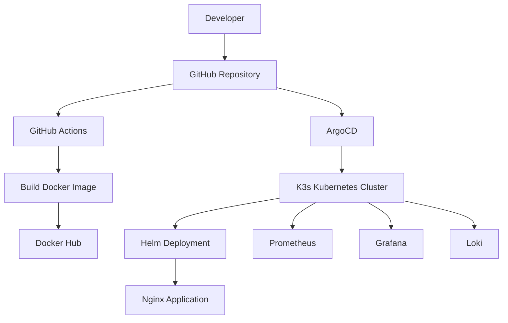

# K3s GitOps Lab

## Overview

This repository demonstrates a **GitOps workflow for deploying applications to a Kubernetes cluster** using a lightweight Kubernetes distribution and modern DevOps tools.

The goal of this lab is to practice and demonstrate:

* Kubernetes application deployment
* GitOps workflows
* Helm chart packaging
* CI pipelines for container images
* Kubernetes monitoring and logging

The repository represents the **desired state of the cluster**, following GitOps principles.

---

# Architecture



---

# GitOps Deployment Flow

The project follows a GitOps model where **Git is the single source of truth**.

1. A developer pushes code to the repository.
2. A CI pipeline builds a Docker image.
3. The image is pushed to the container registry.
4. ArgoCD monitors the Git repository.
5. When changes are detected, ArgoCD synchronizes the cluster state with Git.
6. Applications are deployed using Helm charts.

This approach ensures:

* reproducible deployments
* version-controlled infrastructure
* automated synchronization of cluster state

---

# Tech Stack

### Container Platform

Kubernetes (K3s)

### GitOps

ArgoCD

### Application Packaging

Helm

### CI Pipeline

GitHub Actions

### Container Registry

Docker Hub

### Monitoring

Prometheus

### Visualization

Grafana

### Logging

Loki

---

# Repository Structure

```
k3s-gitops-lab
│
├── app
│   └── nginx application source
│
├── apps
│   └── nginx-helm
│       ├── Chart.yaml
│       ├── values.yaml
│       └── templates
│
├── clusters
│   └── dev
│       └── ArgoCD application manifests
│
├── monitoring
│   └── prometheus-stack configuration
│
└── .github
    └── workflows
        └── ci.yaml
```

---

# Kubernetes Deployment

Applications are deployed using Helm charts stored in the repository.

Each Helm chart contains:

* Kubernetes Deployment
* Service definition
* Configurable values

ArgoCD reads these manifests and ensures the cluster state matches the Git repository.

---

# Monitoring and Logging

The cluster includes an observability stack:

Prometheus collects metrics from Kubernetes workloads.

Grafana provides dashboards for visualizing cluster metrics.

Loki collects logs from running applications.

---

# GitOps Principle

In this project, the repository represents the **desired state of the system**.

The running cluster may not always match the repository state, but Git remains the source of truth.

ArgoCD is responsible for synchronizing the cluster with the repository.

---

# Future Improvements

Possible improvements include:

* Kubernetes ingress configuration
* alerting with Alertmanager
* multi-environment GitOps structure
* infrastructure provisioning with Terraform
* automated image versioning

---

# Author

DevOps / Cloud Infrastructure 
Victor Fiant
